# Report <!-- omit in toc -->
- [Structure](#structure)
- [UML](#uml)
  - [GUI UML](#gui-uml)
  - [System UML](#system-uml)
- [Design assumptions](#design-assumptions)
- [Refactoring](#refactoring)
- [Tools](#tools)
- [!!Note!!](#note)
- [Git Log](#git-log)
- [Screenshot](#screenshot)
<div style="page-break-after: always"></div>

## Structure
This application consist of three packages, being `gui`, `models`, `utils` (as shown in the figure below).

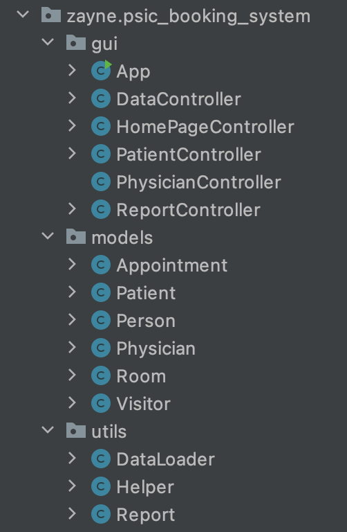

where:
`gui` is in charge of the GUI part of the application.

`models` has the classes with specific implementations.

`utils` is used for refactoring purposes.


## UML
### GUI UML
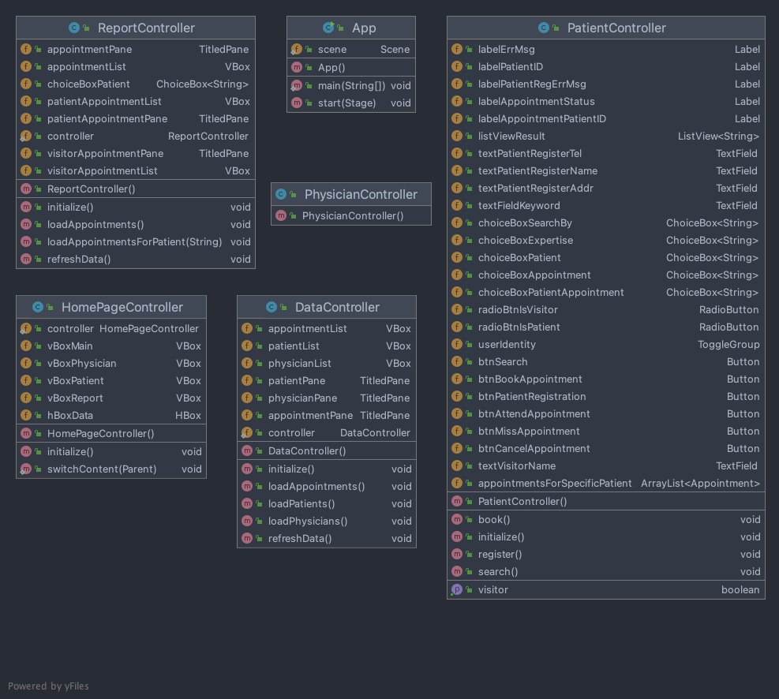

<div style="page-break-after: always"></div>

### System UML
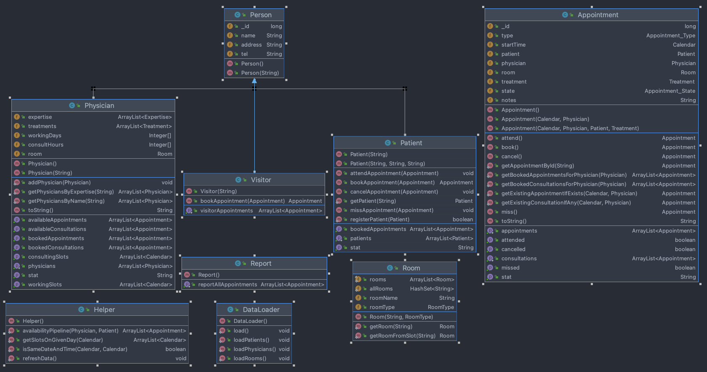

<div style="page-break-after: always"></div>

## Design assumptions
based on the given requirement document, the following assumptions are made.

- Physician
  - Each physician work 2 days per week.
  - The working hours are 10:00 - 18:00.
  - Working days are Monday to Friday each week.
  - Each physician only have one are of expertise.
  - Each physician only have 1 area of expertise.

- Rooms
  - Each physician has a fixed room for their treatments.

- Appointments
  - Each appointment has a fixed duration of 2hrs.
  - Each consultation has a fixed duration of 30min.
  - Consultation and general appointment are differentiated by the `patient` field in `Appointments`, if `appointment.patient == null`, then this appointment is a consultation appointment.

- Patients
  - Patients are identified with their `_id`s rather than names (i.e. patients with the same name are allowed to register)

- Visitors (see `Patient` part)

## Refactoring
Most of the logics and functions are refactored after the initial implementation, or during coding. Method extraction, abstraction are used to refactor the code.

However, due to the time constraint, there are still some part of the application are yet refactored. Refactoring process will continue to be prioritised in the future of this project.

`Observer Design Pattern` was planned but yet implemented due to the time constraint. which will also be implemented in the future update of this application.

## Tools
_This project is developed using JDK 15, there might be issues where the application won't run due to incompatible JDK version._
- Java 15+
- JavaFX
- Maven
- GitHub (git)
- IntelliJ IDEA
- macOS

**(_!!!This project is developed and tested on macOS machines where it runs without any issue. As I don't have a Windows machine at my disposal, multiple platform support was NOT tested!!!_)**

## !!Note!!

To run or build this project.
```bash
# clone the repo from GitHub.
# https://github.com/ZayneLiu/PSIC-BookingSystem.git
git clone https://github.com/ZayneLiu/PSIC-BookingSystem.git

cd PSIC-BookingSystem

# Install dependencies
mvn clean install

# To run the JavaFX application.
mvn clean javafx:run

# To build executable jar file.
mvn clean package onejar:one-jar

# then the jar file should be generated under ./target
# the one ends with `one-jar.jar` is the executable jar file.
```
## Git Log
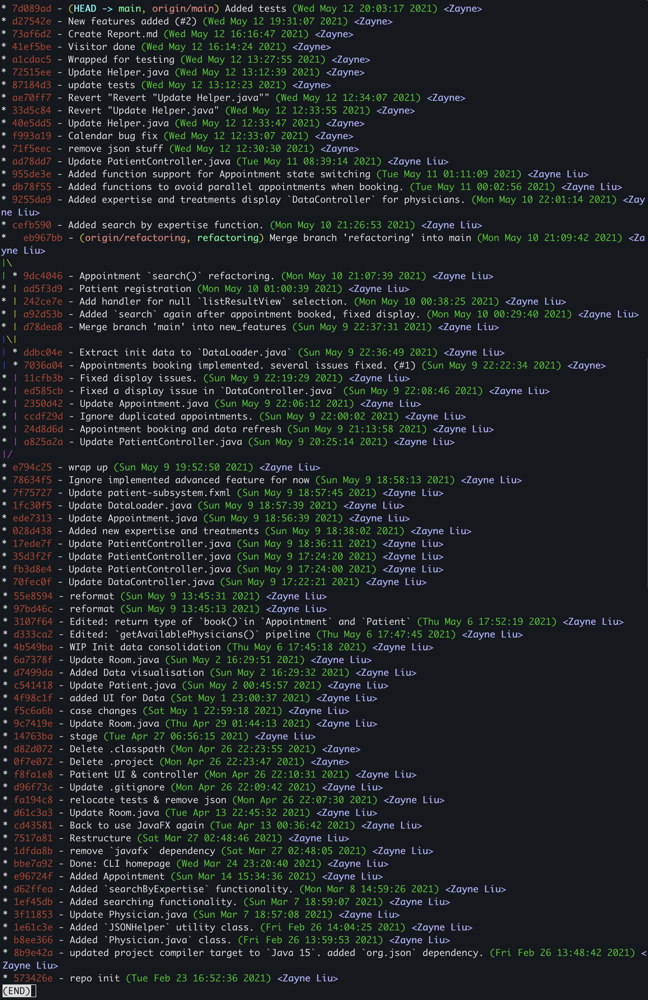

## Screenshot
In the event where the `.jar` file I provided won't run properly on the marking machine, the following screenshot will provide some insight to the application itself.

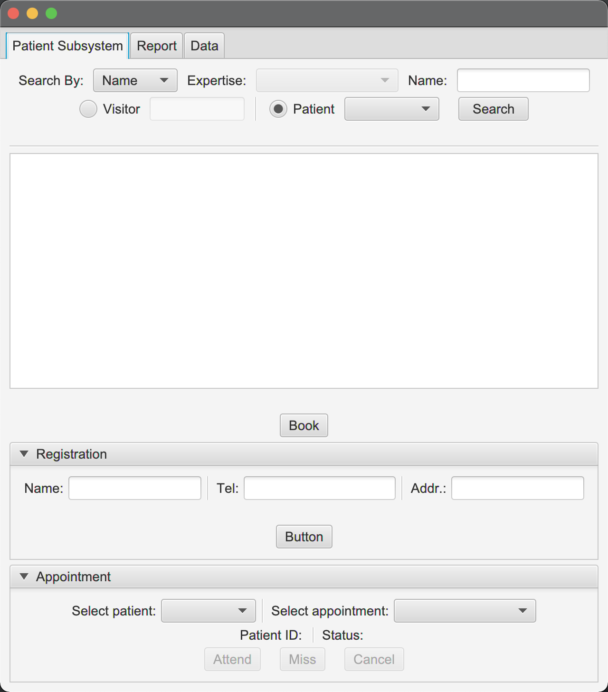

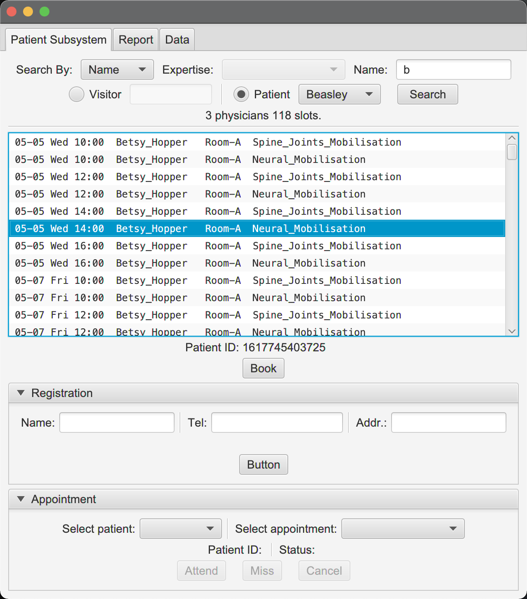

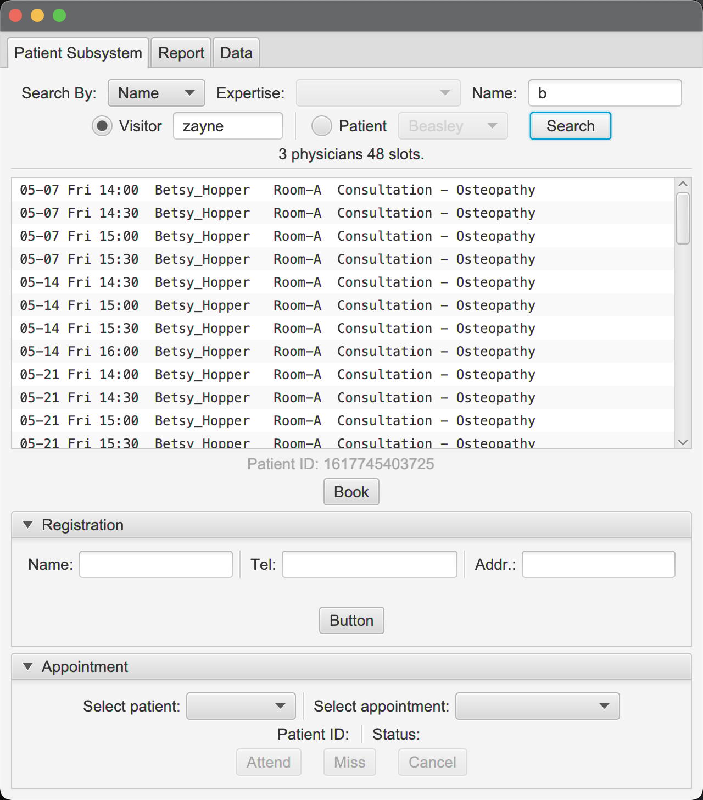

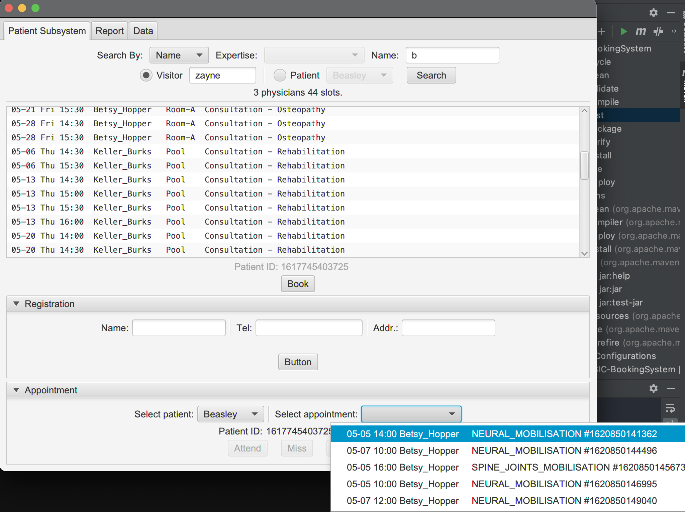

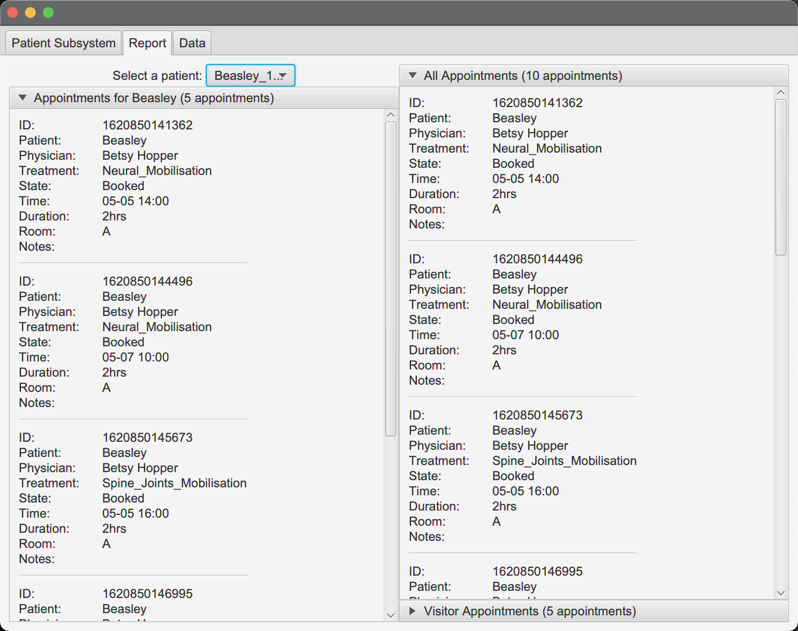

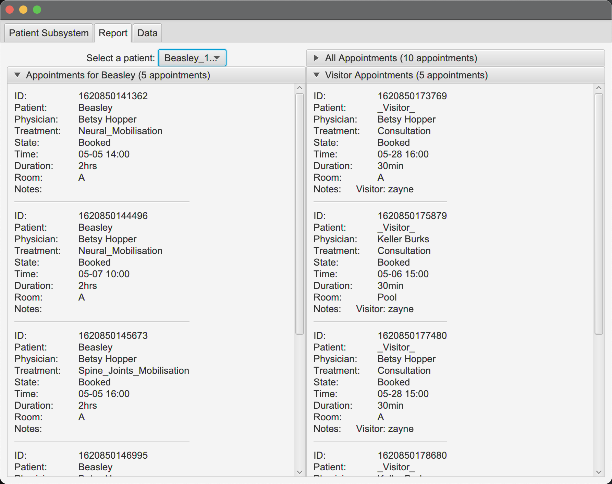

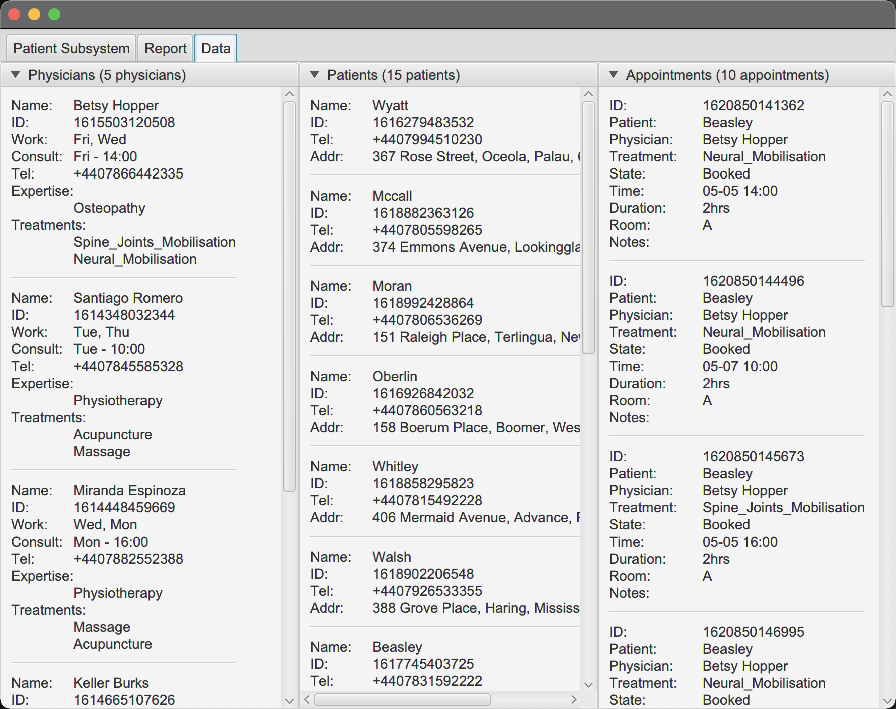
